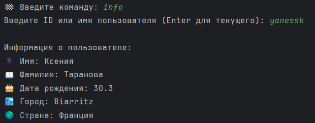
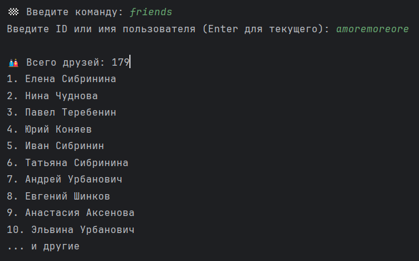
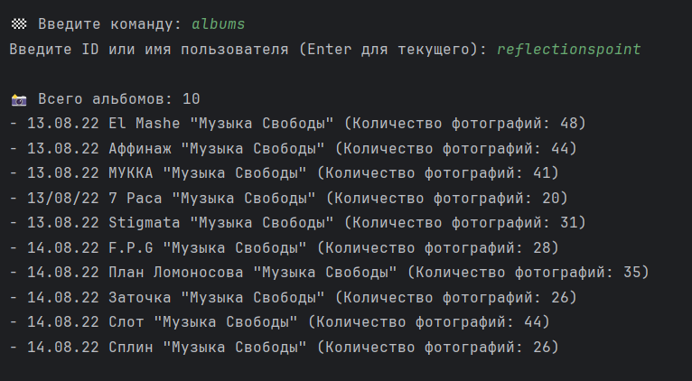
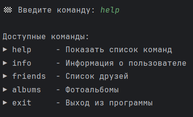
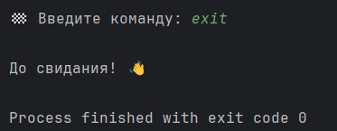

# VK API Client

Консольная утилита для работы с VK API. Позволяет получать информацию о пользователях, их друзьях и фотоальбомах.

## ⚙️ Функционал
- **Авторизация** через токен VK API
- Получение **информации о пользователе** (имя, фамилия, город, страна)
- Просмотр **списка друзей** (первые 10 + общее количество)
- Просмотр **фотоальбомов** (названия и количество фотографий)
- Поддержка **коротких имен** пользователей (screen_name)
- Сохранение токена в файл для повторных запусков

## 🚀 Запуск
1. Установите зависимости:
   ```bash
    pip install -r requirements.txt
   ```
2. Получите токен VK API
   - Сделать это можно по этой ссылке:
    ```copy
    https://vkhost.github.io/ 
    ```
3. Запустите утилиту
    ```bash
    python vk_api.py
    ```
   
## 🧩 Структура классов
### VKAPIHandler
**Ядро для работы с API:**
- Отправка запросов
- Обработка ошибок
- Преобразование screen_name в ID

### DataPrinter
**Форматированный вывод данных:**
- Представление данных для пользователя

### TokenManager
**Работа с токеном:**
- Сохранение в файл token.txt
- Автозагрузка токена при запуске

### VKUtility
**Основная логика приложения:**
- Обработка команд
- Управление потоком выполнения
- Взаимодействие между компонентами

## 🎮 Реализованные команды

### ℹ️ `info` — Информация о пользователе
**Описание:**  
Показывает основную информацию о профиле пользователя.  
**Особенности:**
- Можно указать числовой ID (`123456`) 
- Или короткое имя (`durov`)
- Enter без аргументов — информация о текущем авторизованном пользователе  

**Пример:**

-----


--------


### 👥 `friends` — Список друзей  
**Описание:**  
Выводит список друзей пользователя
**Особенности:**
- Показывает первые 10 друзей
- Отображает общее количество
- Можно указать числовой ID (`123456`) 
- Или короткое имя (`durov`)
- Enter без аргументов — информация о текущем авторизованном пользователе    

**Пример:**  

----


----

### 📚 `albums` — Фотоальбомы  
**Описание:**  
Отображает список фотоальбомов пользователя.  
**Особенности:**
- Выводит Названия альбомов
- Количество фотографий в каждом
- Игнорирует системные альбомы (аватарки и т.д.)  
- Можно указать числовой ID (`123456`) 
- Или короткое имя (`durov`)
- Enter без аргументов — информация о текущем авторизованном пользователе  

**Пример:**  

----


----

### ❓ `help` — Справка  
**Описание:**  
Показывает список всех доступных команд.  

**Пример:**

----


----

### 🚪 `exit` — Выход  
**Описание:**  
Завершает работу утилиты.  

**Пример:**

----


----